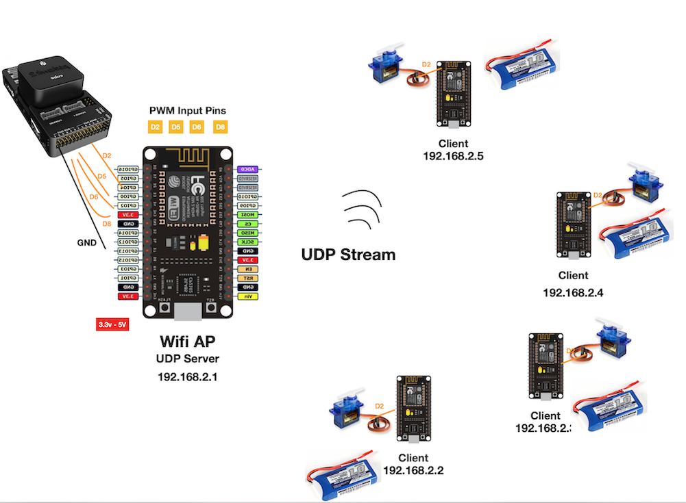
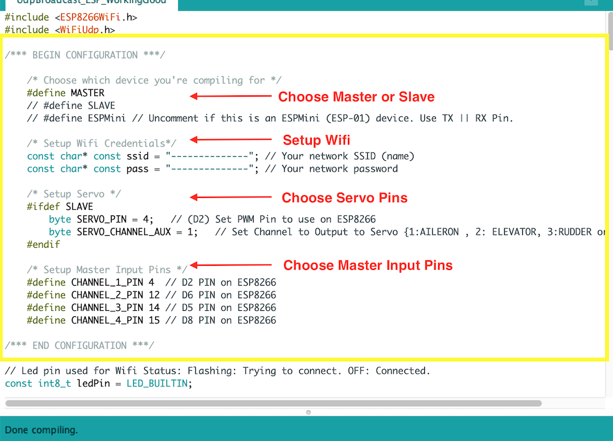

# PWM Wireless Forwarding over UDP

*This is a very experimental project.*

## Idea

We are basically sending a PWM signal over WIFI (UDP) to multiple servo motors using ESP Wifi chips.

## Project

Our specific case involved a radio controlled Blimp. Since payload weight is an important factor of flight time and performance, we decided to take some weight off by getting rid of the cables connecting the flight controller to other parts of the blimp (rudder, aileron, elevator..)

We are reading multiple PWM signals from the onboard Flight Controller using an ESP Wifi Chip acting as an UDP server (AP). The ESP Server is broadcasting a stream of PWM Data to multiple other ESP Client chips (Slaves) controlling Servo Motors individually. Each Client ESP will only pick on its respective channel data from the stream. (Diagram below)

This repo contains sources for both the Access Point and Client. *This is a very experimental project.*

 

## Components

- The [Hex Cube Black](https://docs.px4.io/master/en/flight_controller/pixhawk-2.html) flight controller (previously known as Pixhawk 2.1)
- ESP32
- ESP8266 NodeMCU v3.0
- 4 * Ubec FPV At least 2A Output (BlueSky)
- Battery ( >= 2A )
- 4 * Servos (SG90)

## How to Run

1. Connect the AP to the Pixhawk PWM OUT Pins.
1. Connect the Client to the Servo Motors.
1. Make sure to ground all devices properly to avoid noise and thus servos jittering.

The Client ESP should autoconnect to the AP and start writing to the servos right away.

**Key Considerations**: Interrupts & Duty Cycles.
